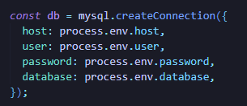
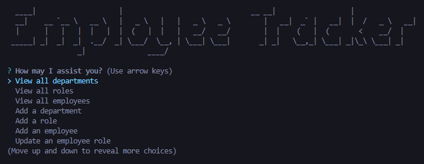
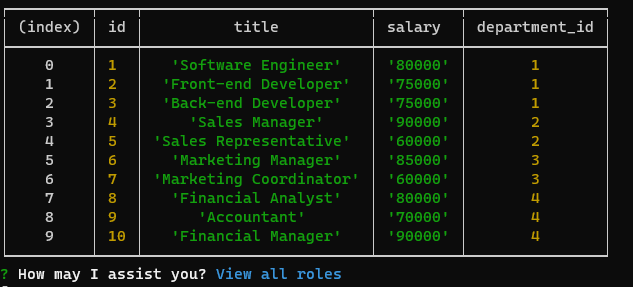
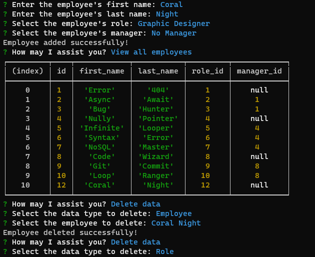

# Employee-Tracker-SQL

  ____|                    |                               __ __|                  |
  __|    __ `__ \   __ \   |   _ \   |   |   _ \   _ \        |   __|  _` |   __|  |  /   _ \   __|
  |      |   |   |  |   |  |  (   |  |   |   __/   __/        |  |    (   |  (       <    __/  |
 _____| _|  _|  _|  .__/  _| \___/  \__, | \___| \___|       _| _|   \__,_| \___| _|\_\ \___| _|
                 _|               ____/

build a command-line application from scratch to manage a company's employee database, using Node.js, Inquirer, and MySQL.

## Description

I was tasked with my tenth challenge to make a Logo SVG Generator.

- learned how to generate svg images
- learned to work more with npms 
- learned to fixed errors
- learned being sick makes catching up very hard ( hahah )
- learned inquire versions matter or your code will note work

**Note**: I followed the criteria below provided by the class instructors.

## User Story

- AS A business owner
- I WANT to be able to view and manage the departments, roles, and employees in my company
- SO THAT I can organize and plan my business

## Acceptance Criteria

- GIVEN a command-line application that accepts user input
- WHEN I start the application
- THEN I am presented with the following options: view all departments, view all roles, view all employees, add a department, add a role, add an employee, and update an employee role
- WHEN I choose to view all departments
- THEN I am presented with a formatted table showing department names and department ids
- WHEN I choose to view all roles
- THEN I am presented with the job title, role id, the department that role belongs to, and the salary for that role
- WHEN I choose to view all employees
- THEN I am presented with a formatted table showing employee data, including employee ids, first names, last names, job titles, departments, salaries, and managers that the employees - report to
- WHEN I choose to add a department
- THEN I am prompted to enter the name of the department and that department is added to the database
- WHEN I choose to add a role
- THEN I am prompted to enter the name, salary, and department for the role and that role is added to the database
- WHEN I choose to add an employee
- THEN I am prompted to enter the employee’s first name, last name, role, and manager, and that employee is added to the database
- WHEN I choose to update an employee role
- THEN I am prompted to select an employee to update and their new role and this information is updated in the database

## Bonus

 **Note**: After working on this on and off for weeks. I give up on the bonus section haha , I know I could do it eventually but I need to move on. Half of the code is there
 but i was not able to get it all working without it constantly breaking.

- Application allows users to update employee managers (2 points) 
- **Note**: half done

- Application allows users to view employees by manager (2 points)
- **Note**: half done

- Application allows users to view employees by department (2 points)
- **Note**: half done

- Application allows users to delete departments, roles, and employees (2 points for each)
- **Note**: Works fully 

- Application allows users to view the total utilized budget of a department—in other words, the combined salaries of all employees in that department (8 points)
- **Note**: half done

 ## Installation
 - To install the Employee Tracker, follow these steps:
 - Clone the repository.
 - Navigate to the project directory.
 - Install the dependencies: npm install
 - Create database in mySQL or Datagrip 
 - Pre-populated your database by copying the code from schema.sql and seeds.sql

**Note**: add your own mySQL information to db.js or .env ( add to .gitignore ) for higher security.

 ## Usage
 - To use the Employee Tracker, run the following command inside the "Root" folder:
 - In terminal enter node app.js
 - Follow [Video Demo](https://www.dropbox.com/scl/fi/gf4gqlzozpoillx7ymo13/Challenge12.mp4?rlkey=i4va6oobpptwqst6d2qkt9dyz&dl=0) if you need further assistance.
 - Answer the prompts.

## Mock-Up

The following image shows the application.

**Note**: This image is a screen shot once I finished the assisnment.

## Credits
- [Macro Font](https://patorjk.com/software/taag/#p=display&f=Shadow&t=Employee%20Tracker)
- [W3School](https://www.w3schools.com/mysql/default.asp)
- [Youtube](https://www.youtube.com/watch?v=5OdVJbNCSso)
- Study Group Support.
- Project 2 gave extra practice.

**Note**: User story and acceptance criteria was provided to me in class
 UNB-VIRT-FSF-PT-04-2023-U-LOLC for Week 12 Challenge. 

## My Github

- [Github](https://github.com/xNoirNightx/Employee-Tracker-SQL)

## License

